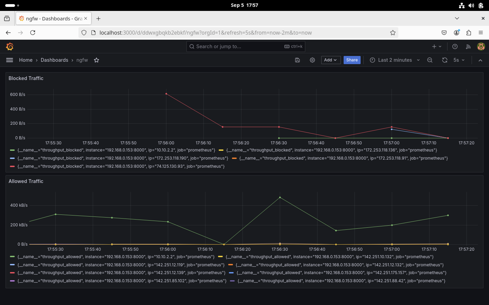

# ngfw
next generation firewall

# features:
- [x] parse dns and record domain ip mapping
- [x] count traffic in bytes
- [x] blacklist ip addresses
- [x] domain filtering
- [x] visualisation
- [x] ICMP flood detection
- [x] port scan detection
- [ ] fast mitigation logic

# issues:
- [ ] is_ip_blacklisted is slow. need to optimize it.

